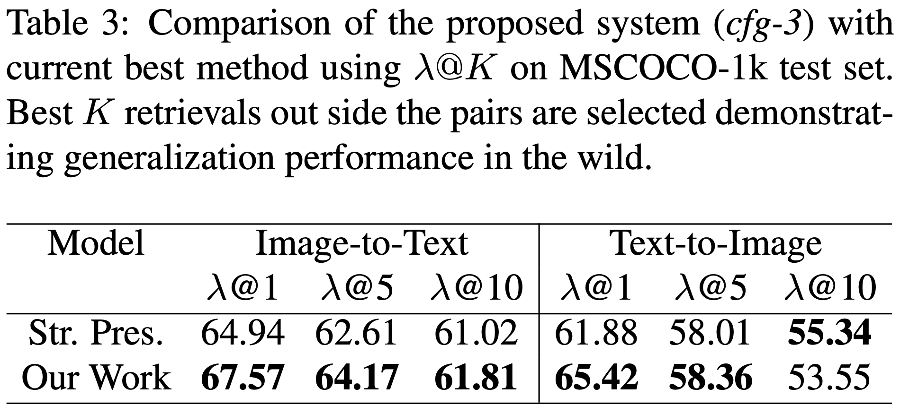

## Do Cross Modal Systems Leverage Semantic Relationships?
This is the code for our ICCV'19 paper on cross modal learning and retrieval.


## Project Page

## Dataset

## Training and Testing

## Trained Models

## Qualitative Results
Embedding of MSCOCO test set in latent space visualized using t-SNE. The semantically similar text feature vectors (shown in red) and the image feature vectors (shown in blue) are close in the embedding space. Few bidirectional retrieval results are also shown which are semantically similar. It is important to note that not all occur in same class i.e. not all are pairs (image and 5 caption pairs) in the MSCOCO dataset.


## Quantitative Results
Two variations of results are shown here. The first table compares the network with the state-of-the-art techniques available. In the second table, we forcibly do not consider those retrieval results which occur in pairs (image and 5 caption pairs) in the MSCOCO dataset.





## Citation
If you use the code or the approach, please consider citing the work.
```
@inproceedings{nawaz2019cross,
  title={Do Cross Modal Systems Leverage Semantic Relationships?},
  author={Nawaz, Shah and Kamran Janjua, Muhammad and Gallo, Ignazio and Mahmood, Arif and Calefati, Alessandro and Shafait, Faisal},
  booktitle={Proceedings of the IEEE International Conference on Computer Vision Workshops},
  pages={0--0},
  year={2019}
}
```
